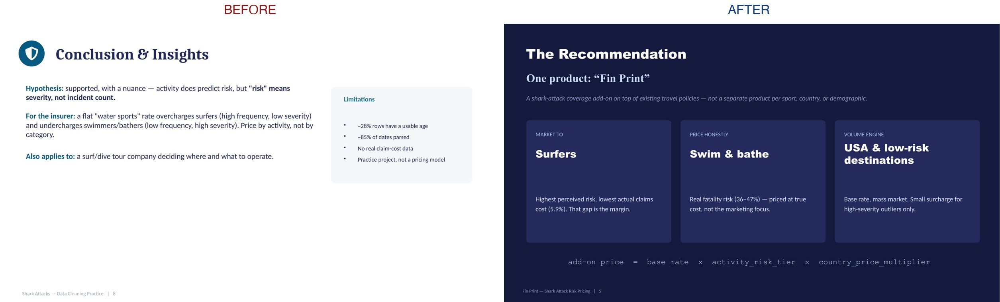

# Shark Attacks — Data Cleaning Practice (Ironhack Week 2 Quest)

Practice project: clean the [Global Shark Attack File](https://www.sharkattackfile.net/incidentlog.htm)
(`data/GSAF5.xls`, 7,103 incidents) with pandas, then use it to test a
hypothesis and build a business recommendation.

## Summary

- **9 pandas cleaning techniques** applied to the full dataset (nulls,
  duplicates, regex, category normalization, date parsing)
- **Frequency vs. severity:** surfing has the most attacks (1,158) but the
  lowest fatality rate (5.9%); swimming/bathing is rare but often fatal
  (36–47%) — "most attacks" ≠ "most risk"
- **Geography compounds it:** Australia is 4.5× deadlier than the USA per
  incident
- **Post-feedback:** one business recommendation ("Fin Print"), not three
  separate ideas — priced by activity-risk tier × country multiplier,
  targeting the segment where perceived risk is highest and real cost is
  lowest (surfers), instead of fragmenting by sport/country/sex

<details>
<summary>Assignment brief, summarized</summary>

- Clean the dataset with ≥5 pandas techniques; formulate a hypothesis
  (Business Case is explicitly optional); run basic EDA to validate it
- Modularize cleaning into `.py` files with one main pipeline function
- Deliverables: GitHub repo, ≥1 notebook, `.py` files, README, online
  slides URL (no PowerPoint/Keynote files)
- Suggested slides: Title → Overview → Cleaning (1-2 slides) → EDA →
  Major Obstacle → Conclusion → Closing (7-10 total) — a guide, not a
  fixed template

The brief itself expects a couple of cleaning slides — it doesn't say to
minimize it. The push toward one business recommendation came from the
professor's feedback on my specific presentation, not a base requirement.

</details>

## Business case

A travel/water-sports insurer wants to price shark-attack risk **by
activity**, not one blanket rate. Insurance pricing runs on frequency ×
severity, which is exactly the shape of the finding: activities split
into "many incidents, rarely severe" vs. "few incidents, often severe."

### Post-feedback: one product, not three




**"Fin Print"** — a shark-attack coverage add-on on top of existing
travel policies. One product, not a policy per sport, country, or
demographic. *(Name plays on "fine print" — the policy detail this
recommendation prices. Logo: an upside-down shark tooth read as both a
**fin** and a **boat hull**.)*

**The angle — sell where perceived risk beats real risk:** surfers fear
sharks most (1,158 attacks) but are rarely hurt (5.9% fatal) — that gap
is the margin. Swimming/bathing (36–47% fatal) is priced at true risk,
not underpriced, protecting that margin. Geography does the same job:
USA is the low-risk volume engine (2.6%); Australia/Bahamas/South
Africa/Brazil get a moderate uplift (11–15%); New Caledonia/Mexico are
tiny-volume extreme-severity outliers, priced up sharply.

```
add-on price = base rate × activity_risk_tier × country_price_multiplier
```

**Why not fragment by sport, country, or sex:** the formula already
handles activity + country in one product. Sex specifically can't be
priced — GSAF counts attacks, not participants, so more male attacks
could just mean more men do these activities; no exposure data, no
individual-risk claim.

**Solid vs. directional:** the tiering logic is built from 7,103 cleaned
records. Real premium numbers still need exposure and claim-cost data
GSAF doesn't have — this is a pricing *structure*, not a final rate card.

## Data cleaning techniques

All in [`cleaning.py`](cleaning.py), chained into `clean_shark_data()`:

1. Drop unused columns
2. Strip whitespace from every text column
3. Standardize column names to snake_case
4. Clean categorical columns (`type`/`sex`/`fatal`) → fixed set + `"Unknown"` fallback
5. Clean country names (uppercase + fix typos)
6. Extract numeric age via regex
7. Parse dates from mixed formats
8. Fill missing categoricals with `"Unknown"` (not `NaN`, so they aren't silently dropped)
9. Remove duplicate rows

**Missing values:** categorical → `"Unknown"` (keeps rows countable in
groupby); numeric/date → left as real `NaN`/`NaT`, never imputed
(`age` ~28% usable, `date_parsed` ~85% parsed).

## Notebooks

- [`shark_attacks_analysis_aroa.ipynb`](shark_attacks_analysis_aroa.ipynb) — individual deliverable: cleaning → EDA → Fin Print recommendation.
- [`shark_attacks_analysis_group.ipynb`](shark_attacks_analysis_group.ipynb) — same core analysis + a "Team Addendum" documenting teammates' angles (sex-based risk, country coverage strategy) and why each needs a caveat. The Fin Print correction is individual, not reproduced here.

Both import `cleaning.py`/`eda.py`; the group notebook also imports
`team_contributions.py` for a teammate's reusable functions.

## Project structure

```
data/GSAF5.xls                          raw dataset
cleaning.py / eda.py                    cleaning pipeline + EDA helpers
team_contributions.py                   teammate's reusable functions
shark_attacks_analysis_aroa.ipynb       individual notebook
shark_attacks_analysis_group.ipynb      + team addendum
slides/                                 decks, logo, before/after image (see slides/README.md)
requirements.txt
```

## Running it

```bash
pip install -r requirements.txt
jupyter notebook shark_attacks_analysis_aroa.ipynb
```

## Slides

Two decks — see [`slides/README.md`](slides/README.md) for both, plus
the Google Slides links (original presented deck vs. corrected "Fin
Print" deck).

## Limitations

- ~28% of rows have a usable `age`, ~85% have a parseable `date`
- Fatality outcome may be affected by reporting bias
- No exposure/participation data → attack counts show popularity, not individual risk
- No claim-cost data → "severity" here means fatal/not, not a monetary loss
- Practice/exercise analysis, not a rigorous pricing model
